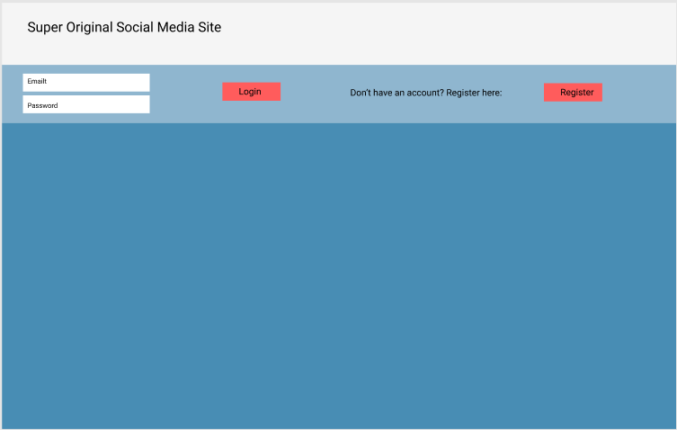
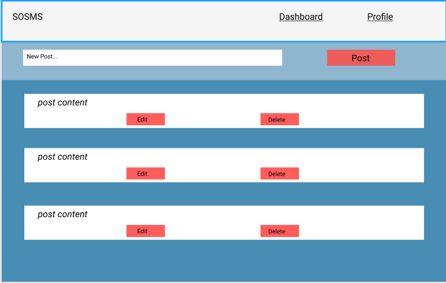
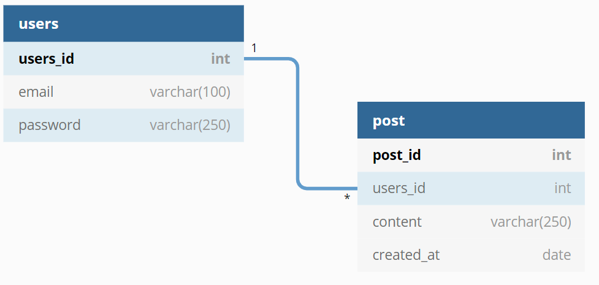

## MVP:
  - User can create an account
  - User can log in to their account
  - User can create new post
  - User can edit a post
  - User can delete a post
  - User can view their profile info (email, user id)
  - User can logout

## Wireframes:

## Endpoints:

### Auth endpoints

- app.post('/auth/login', authCtrl.login) - receives email and password on req.body. Runs db.check_user and checks password with bcrypt, puts user on session and returns user. If no user found returns 404, ‘User does not exist’. 

- app.post('/auth/register', authCtrl.register) - receives email and password on req.body. Runs db.check_user. if user found returns 409 ‘User already exists’. If no user found, hashes password with bcrypt and runs db.register_user, puts user on session and returns user. 

- app.delete('/auth/logout', authCtrl.logout) - destroys session. returns status 200

- app.get('/auth/user', authCtrl.getUser) - checks if there is a user on session: if there is returns users. if no user on session returns 404. 

### Post endpoints

- app.get('/api/posts', postCtrl.getPosts) - runs db.get_posts and returns result.  

- app.post('/api/posts', postCtrl.addPost) - receives users_id and content on req.body and passes them to db.add_post. Then runs db.get_posts and returns result. 

- app.put('/api/posts/:post_id', postCtrl.editPost) - receives post_id on req.params, content on req.body and passes them to db.edit_post. Then runs db.get_posts and returns result.

- app.delete('/api/posts/:post_id', postCtrl.deletePost) - receives post_id on req.params and passes it to db.delete_post. Then runs db.get_posts and returns result.

## DB
